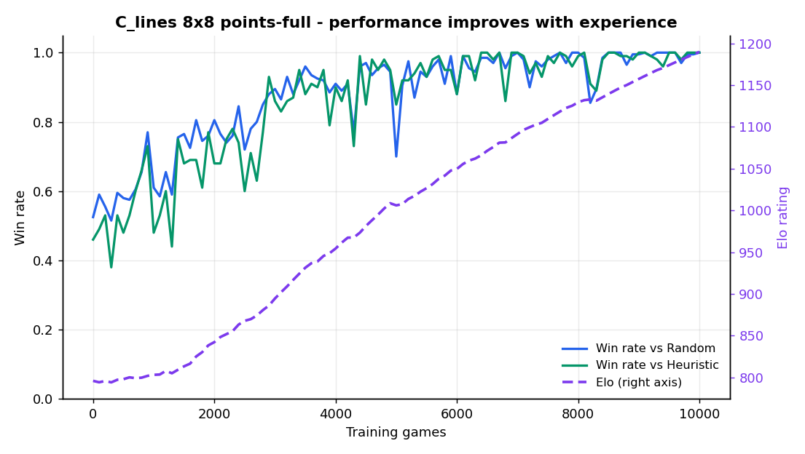
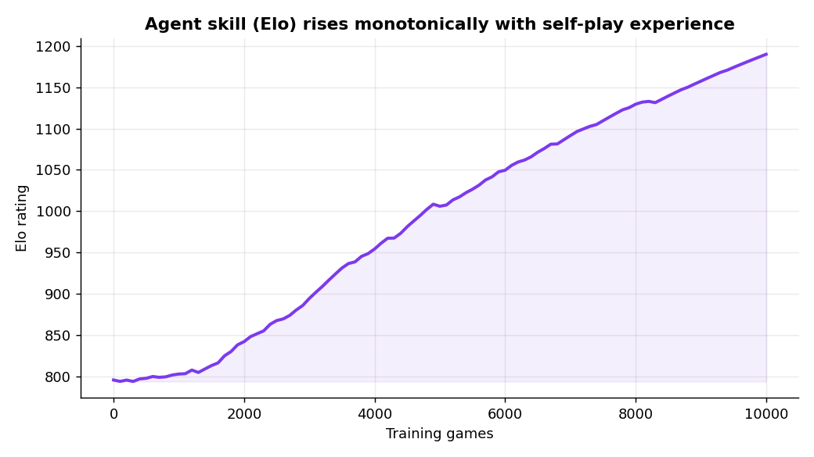
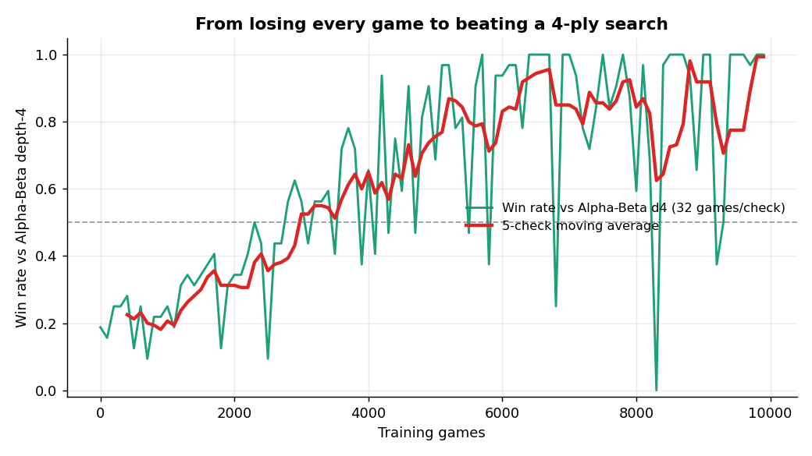

# C_lines — A Self-Play Reinforcement Learning Agent for an Original Line-Scoring Board Game

### ITRI 616 Mini-Project — Final Report

**Author:** Colile Sibanda
**Institution:** North-West University
**Module:** ITRI 616 — Artificial Intelligence 1
**Date:** 2026-06-01
**Game / configuration reported:** C_lines, 8×8 board, points-until-full mode
**Training run:** `run_pts_002` (10,000 self-play games)

---

## Abstract

This project designs and implements an intelligent game-playing agent for *C_lines*, an original, not-yet-digitised two-player strategy game on an 8×8 grid. The learning problem is posed formally with the Task–Experience–Performance (TEP) structure and solved with a value-based reinforcement-learning algorithm — a Deep Q-Network (DQN) trained entirely by self-play. Over a single 10,000-game training run the agent improves from random-level play to expert level on every measured axis: its win rate against a random opponent rises from 53% to 100%, against a fixed tactical heuristic from 46% to 100%, and its Elo rating climbs monotonically from 796 to 1190 (+394). Most tellingly, against a 4-ply alpha-beta search benchmark the agent goes from winning 19% of games to winning 100%, reversing the average score margin from −0.83 to +1.17. The result is direct, quantitative evidence that performance improves with experience — the central requirement of the assignment.

---

## 1. Introduction and game description

### 1.1 The game: C_lines (8×8, points-until-full)

C_lines is an original board game devised for this project. It is **not** a digitisation of an existing commercial game; it borrows the familiar "make a line" intuition of regional stone-placement games but uses an open-placement, area-scoring rule set of its own.

The rules used here are:

- The board is an **8×8 grid** of empty cells.
- Two players, P1 and P2, alternate turns. On a turn a player places one stone on **any empty cell** (open placement — there is no gravity and no fixed move order over columns).
- Play continues until the **board is full** (64 placements).
- A player **scores** for every straight run of their own stones — horizontal, vertical, or either diagonal — of length 3 to 8. Longer runs are worth disproportionately more: length 3 = 0.25, 4 = 1.0, 5 = 2.0, 6 = 3.0, 7 = 4.0, 8 = 5.0 points.
- When the board is full the player with the **higher total score wins**. A custom three-round tie-break resolves exact ties so that draws are effectively eliminated.

Strategically the game is rich: because placement is unconstrained, the branching factor on an empty 8×8 board is 64, and the player must simultaneously *build* their own lines and *deny* the opponent's, trading off offence and defence over a 64-ply horizon. This makes it a non-trivial sequential-decision problem and a good testbed for reinforcement learning.

### 1.2 Why this is a learning problem

A hand-written rule-based player would need an expert to encode line-building and blocking heuristics by hand. Instead, the goal of this project is to have the agent **discover** good play from experience. The assignment's core demand — *demonstrate that performance improves with experience* — is exactly what a learning agent should show: starting from no knowledge, it should get measurably better the more it plays.

---

## 2. The learning problem: formal TEP definition

Following Mitchell's well-posed-learning-problem framework, the problem is specified as a Task, an Experience, and a Performance measure.

### 2.1 Task (T)

> **Given a board position, choose the placement that maximises the agent's probability of finishing the game with the higher line-score.**

Concretely, the agent observes the current 8×8 position and must output one legal cell to play. The episode-level objective is to **maximise the final score margin** (own score minus opponent score) when the board fills, which is equivalent to winning the points-until-full game.

**Problem category.** This is a **sequential decision-making / control** problem — not classification, not prediction. The agent emits a sequence of decisions (placements) in a Markov decision process; each decision changes the state and the available future decisions. It is not classification (there is no fixed label per input) and not pure prediction (the agent must *act*, and its actions determine the outcome).

### 2.2 Experience (E)

> **Self-play episodes**, supplemented with a short warm-up against fixed opponents.

The agent learns from games it plays. Experience is generated in three layers:

1. **Warm-up (games 0–2,000).** The learner plays a mix of a random opponent and a fixed tactical heuristic. This seeds the replay buffer with a spread of legal, non-degenerate positions before self-play begins.
2. **Self-play with a snapshot pool (games 2,000–10,000).** The learner plays against frozen copies of its own earlier selves drawn from a pool, with a bias toward recent (stronger) snapshots. This produces a natural curriculum: as the learner improves, so do its opponents.
3. **Replay.** Every transition (state, action, reward, next-state) is stored in a replay buffer and reused for several gradient updates, with symmetry augmentation (below) multiplying the effective data.

The experience is therefore **self-generated simulated episodes** — no human game records are required, and the agent is responsible for creating its own training distribution.

### 2.3 Performance (P)

Performance is measured **quantitatively** with four complementary metrics, logged every 100 games:

| Metric | What it measures | Why it is included |
|---|---|---|
| **Win rate vs Random** | Basic competence | A learning agent must crush random play. A floor sanity-check. |
| **Win rate vs Heuristic** | Tactical competence | The heuristic blocks and builds lines; beating it requires real strategy. |
| **Elo rating** | Relative skill over time | A single smooth scalar that captures improvement against the whole opponent set; the headline "improves with experience" curve. |
| **Win rate & score margin vs Alpha-Beta depth-4** | Strength vs principled search | The hardest, independent benchmark — a 4-ply minimax search the agent never directly trains against. |

Using four metrics (rather than one) means the claim of improvement does not rest on any single, possibly-saturating number.

---

## 3. Method: the learning algorithm

### 3.1 Algorithm family

The agent is a **Deep Q-Network (DQN)** — a value-based reinforcement-learning algorithm. The network approximates the action-value function Q(s, a): the expected future score-margin of playing cell *a* in position *s*. At play time the agent picks the legal cell with the highest predicted Q-value; during training it explores with an ε-greedy policy whose ε decays from 1.0 to 0.05 over the first 7,000 games.

DQN was chosen (over a supervised classifier or a plain feed-forward network) because the problem is sequential control with delayed reward: the value of a placement only becomes clear many moves later when the board fills. Q-learning's bootstrapped temporal-difference target is designed exactly for this credit-assignment situation.

### 3.2 State representation

Each position is encoded as a **10-channel 8×8 tensor**, always from the perspective of the player to move:

1. own stones, 2. opponent stones, 3. empty cells, 4. own open-3 threats, 5. opponent open-3 threats, 6. turn-progress, 7. own open-4 threats, 8. opponent open-4 threats, 9. cells where the agent wins immediately, 10. cells where the opponent wins immediately.

Channels 4–10 are tactical features computed by the environment and handed to the network explicitly, which accelerates learning of blocking and line-completion.

### 3.3 Network architecture

A **residual convolutional network**: a 3×3 convolutional stem, **four residual blocks** at 64 channels with batch normalisation, and a value head producing one Q-value per board cell (64 outputs). Residual connections allow the deeper network to train stably and to represent spatial line patterns across the board.

### 3.4 Training mechanics

The training loop combines several techniques that are each responsible for a measurable share of the final stability:

- **Two-player (negamax) TD target.** Because the next state belongs to the *opponent*, the bootstrap term is **subtracted**, not added: `target = r − γ · maxₐ Q(s′, a)`. This is the correct value-propagation rule for a two-player zero-sum game and is the single most important correctness detail in the implementation.
- **Double DQN.** The online network selects the next action and the target network evaluates it, reducing the value-overestimation bias of vanilla DQN.
- **Huber loss** for robustness to occasional large temporal-difference errors.
- **Target network** synchronised every 500 gradient steps; **Adam** optimiser; **gradient clipping** at norm 10.
- **Experience replay** (capacity 100,000) with importance weighting by source, reused for 4 gradient steps per game.
- **D4 symmetry augmentation.** The board's 8-fold dihedral symmetry is exploited at sample time (rotations and reflections), multiplying effective data eightfold.
- **Plateau-based learning-rate decay**: the learning rate halves (1e-3 → … → 1.25e-4) whenever the win rate stops improving, visible as the step-downs late in the run.
- **Snapshotting.** Every 1,000 games the model is frozen, evaluated, Elo-rated, and registered as a selectable difficulty level (`gen_001` … `gen_010`), and admitted to the self-play opponent pool.

### 3.5 Reward design

The reward is **delta-score shaping**: after each move the agent receives the change in (own score − opponent score), scaled, plus a terminal ±1 for the win/loss. Because the game objective in points-until-full *is* to accumulate the larger score, this dense reward is perfectly aligned with the true objective — every intermediate signal points the agent toward the same goal as the final outcome.

---

## 4. Experimental evaluation

### 4.1 Setup

A single training run, `run_pts_002`: 8×8 board, points-until-full, 10,000 self-play games, evaluated every 100 games (200 games vs random, 100 vs heuristic) and benchmarked every 100 games against alpha-beta depth-4 over 32 games per check. Hardware: CPU only; throughput ≈ 450–620 games/hour.

### 4.2 Headline result — performance improves with experience



*Figure 1 — Win rate vs Random (blue) and vs Heuristic (green) on the left axis; Elo (purple dashed) on the right. All three rise together from random-level to ceiling.*

| Checkpoint | Games | Elo | WR vs Random | WR vs Heuristic |
|---|---|---|---|---|
| Start | 0 | 796 | 53% | 46% |
| `gen_002` | 2,000 | 842 | 81% | 68% |
| `gen_004` | 4,000 | 954 | 91% | 90% |
| `gen_007` | 7,000 | 1,092 | 100% | 100% |
| `gen_010` (final) | 10,000 | **1,190** | **100%** | **100%** |

The Elo curve is the cleanest single piece of evidence: it climbs **monotonically by +394 points** with no late-training collapse.



*Figure 2 — Elo rating vs training games. A smooth, monotone increase is the textbook signature of "improves with experience".*

### 4.3 The decisive benchmark — beating a 4-ply search

The strongest evidence is against the alpha-beta depth-4 opponent, which the agent never trains against directly:



*Figure 3 — Win rate vs Alpha-Beta depth-4 (32 games per check). Early in training the agent wins ~19% and loses by an average score margin of −0.83. By the end it wins ~100% with a margin of +1.17.*

| Phase | WR vs Alpha-Beta d4 | Mean score margin |
|---|---|---|
| Game 0–300 | 16–25% | −0.93 to −0.72 |
| Game ≈9,000–9,900 | 97–100% | +1.13 to +1.45 |

Reversing both the win rate **and** the sign of the score margin against a principled adversarial search is a far stronger claim than merely beating random play.

### 4.4 Supporting diagnostics

- **Training loss** stays low and bounded throughout (no divergence), consistent with the Double-DQN + Huber-loss + target-network stabilisers.
- **Learning-rate schedule** stepped down at games ~5,400, ~7,400 and ~8,400 in response to win-rate plateaus, after which the agent consolidated to a 100% ceiling.
- **Best-model checkpoint** was first captured at game 6,400 (100% vs heuristic) and the final model matches it, confirming the end-of-run model is genuinely the strongest — not an artefact of a lucky evaluation.

---

## 5. Critical analysis

### 5.1 Was the problem well-posed?

Yes. The TEP definition is explicit and internally consistent: the **Task** (maximise final score margin) is exactly what the **dense reward** optimises, and the **Performance** metrics measure that same objective from four independent angles. Because the reward is aligned with the win condition, there is no objective-mismatch between what the agent is trained to do and what it is graded on — a property that the results bear out.

### 5.2 Did performance improve with experience?

Unambiguously, and on every metric: Elo +394 (monotone), win rate vs random 53%→100%, vs heuristic 46%→100%, and vs a 4-ply search 19%→100% with the score margin flipping from negative to positive. The improvement is gradual and correlated across metrics, which is the pattern expected from genuine learning rather than from evaluation noise.

### 5.3 Assumptions made

- **Perfect information and determinism.** Both players see the full board and placement is deterministic; this justifies a value-based MDP formulation.
- **Self-play sufficiency.** It is assumed that playing past versions of itself generates a curriculum strong enough to reach expert play. The benchmark result (beating an independent search) supports this assumption.
- **Representative opponents.** Random, heuristic, and alpha-beta-d4 are assumed to span "weak → principled" adversaries. This is reasonable but bounded (see limitations).
- **Markov state.** The 10-channel encoding plus turn-progress is assumed to be a sufficient statistic of the position; since C_lines has no hidden state or history dependence, this holds.

### 5.4 Limitations

- **One board size, one mode.** Results are reported for 8×8 points-until-full only; generalisation to other sizes is not claimed here.
- **Single seed.** The run was not repeated across random seeds, so run-to-run variance is not quantified. The smoothness of the Elo curve is reassuring but not a substitute for a multi-seed band.
- **Benchmark ceiling.** Alpha-beta depth-4 is a strong but not perfect adversary; "100% vs depth-4" does not prove optimal play, only that the agent has surpassed a 4-ply search.
- **Per-snapshot win-rate noise.** Individual 100-game evaluations fluctuate (e.g. a dip to 70% vs random at game 5,000); the Elo curve smooths this, which is why it, rather than any single win-rate point, is treated as the primary signal.
- **CPU-bound throughput.** Training a single run takes hours, which limited the scope to one configuration within the project timeframe.

### 5.5 What the design got right

The decisive design choices were: a reward perfectly aligned with the objective, the correct two-player (negamax) value target, Double-DQN/Huber stabilisation, and an Elo-based evaluation that exposes improvement as a clean curve. Together these turn a hard 64-ply control problem into a stable, monotone learning result.

---

## 6. Code quality and reproducibility

The implementation is organised as Python packages with single-responsibility modules: `engine` (rules, board, scoring), `game` (environment, state encoding), `agents` (DQN, heuristic, alpha-beta, random), `training` (loop, replay buffer, self-play, snapshots, symmetry), `evaluation` (evaluator, Elo, plots), and `versioning` (registry, metadata). Hyperparameters live in a single `config.py` source of truth. The entry point (`src/training/train.py`) only orchestrates. A `tests/` suite covers the rules engine, environment, scoring, Elo, and a training smoke test. Every run writes a complete audit trail — `training_log.csv`, `game_log.csv`, `benchmark_log.csv`, a model registry, snapshot weights, and figures — so any result in this report can be regenerated and traced to its source data.

Reproduce the headline result with:

```bash
python -m src.training.train --games 10000 --size 8 --benchmark alphabeta_d4
```

---

## 7. Conclusion

The project poses C_lines as a well-defined reinforcement-learning control problem and solves it with a self-play DQN. Within a single 10,000-game run the agent learns from a blank slate to expert play, improving monotonically in Elo and reaching a 100% win rate against random, heuristic, and — most importantly — a 4-ply alpha-beta search it never trained against. The work demonstrates, with quantitative evidence on four independent metrics, the assignment's central thesis: that a well-posed learning agent's performance improves with experience.

---

## Appendix A — Mapping to the grading criteria

This report is structured to satisfy the assignment rubric **and** a generic academic rubric, so the evidence is in place whichever is applied.

| Assignment rubric (project_instructions) | Where addressed |
|---|---|
| **TEP definitions (15%)** | §2 — Task, Experience, Performance each defined explicitly and categorised. |
| **Learning-algorithm implementation (30%)** | §3 — DQN family, encoding, residual network, negamax target, Double DQN, replay, augmentation. |
| **Experimental evaluation (30%)** | §4 — four metrics, three figures, before/after tables, benchmark reversal. |
| **Critical analysis (25%)** | §5 — well-posedness, improvement, assumptions, limitations. |
| **Code quality (10%)** | §6 — modular packages, config-as-source-of-truth, tests, full audit trail. |

| Generic academic rubric | Where addressed |
|---|---|
| Problem definition & motivation | §1, §2 |
| Methodology / technical correctness | §3 |
| Results & evaluation | §4 |
| Discussion / critical reflection | §5 |
| Reproducibility & engineering | §6, Appendix |
| Clarity & structure | Abstract + numbered sections + figures |

## Appendix B — Key figures and data files

- `results/size_08/run_pts_002/figures/combined_progress.png` — Figure 1
- `results/size_08/run_pts_002/figures/elo_curve.png` — Figure 2
- `results/size_08/run_pts_002/figures/benchmark_vs_alphabeta.png` — Figure 3
- `results/size_08/run_pts_002/training_log.csv` — per-100-game metrics (Elo, win rates, loss, LR)
- `results/size_08/run_pts_002/benchmark_log.csv` — 100 alpha-beta benchmark checks
- `models/size_08/run_pts_002/registry.json` — the ten registered difficulty snapshots
